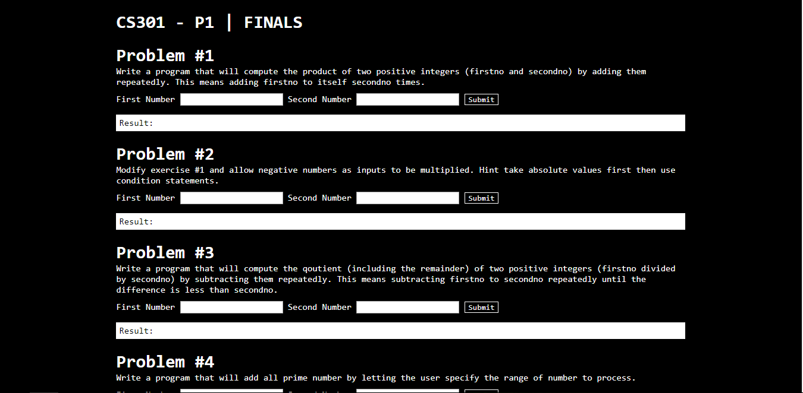

# JavaScript Exercise 003
My answers, **unless stated otherwise**, to the challenges that we're given to us in our JavaScript subject. Also, if you have any criticisms or suggestions feel free to notify me so I can work on it as soon as I can. :smiley: 

### Question #1
Write a program that will compute the product of two positive integers (firstno and secondno) by adding them repeatedly. This means adding firstno to itself secondno times.

### Question #2
Modify exercise #1 and allow negative numbers as inputs to be multiplied. Hint take absolute values first then use condition statements.

### Question #3
Write a program that will compute the qoutient (including the remainder) of two positive integers (firstno divided by secondno) by subtracting them repeatedly. This means subtracting firstno to secondno repeatedly until the difference is less than secondno.

### Question #4
[This is where I got this, I think](https://stackoverflow.com/questions/46490253/printing-prime-numbers-between-a-range-from-slider-input)
Write a program that will add all prime number by letting the user specify the range of number to process.

### Question #5
Write a program that gets the Fibonacci of a number read from the user. The Fibonacci number sequence begins with 1,1 then each succeeding number in the sequence is the sum of the previous ones. For example, an input of 5 will produce 1,1,2,3,5 and an input of 8 will produce 1,1,2,3,5,8,13,21 and an input of 2 will produce 1,1.

### Question #6
[Not my solution](https://medium.freecodecamp.org/how-to-factorialize-a-number-in-javascript-9263c89a4b38)
Write a program that will compute for the factorial of a supplied number. The factorial of the number if the product of those numbers starting from 1 to supplied number.

### Question #7
*Not my solution. I forgot where i got this.*
An integer is perfect if it is the sum of its proper divisors. For example. 6 = 1 + 2 + 3, 28 = 1 + 2 + 4 + 7 + 14. Write a program that determines whether or not an integer input from a terminal is perfect.

### Question #8
Write a program that will derive the sum of series of a number. For example, an input of 5 will produce "(1 + 2 + 3 + 4 + 5 = 15)".

### Question #9
[Not sure of this solution](https://www.quora.com/If-1-11-2-22-3-33-4-44-5-55-6-66-7-77-then-11)
Write a program that will derive the sum of series of number. For example, an input of 5 will produce "55(1 + 2 + 3 + 4 + 5 = 55)"

### Question #10
Write a program that will output the sum of the powers from 1 to supplied number. For example, input of 4 will produce 288 (1 + 2 + 3 + 4 = 288) (1^1+2^2+3^3+4^4 = 288)

### Question #11
Write a program that reverses the input number. Formulate an equation to come up with the answer (Apply the loop statements in your solutions). For example, an input of 1238 will produce 8321.

### Question #12
Write a program to conver a number to an english equivalent string formed from the digits. For example, 123 represented by "One two Three" and 4017 is represented by "Four zero one seven".

### Question #13
Write a program to convert a number to an english equivalent string formed from the reversed digits for example, 123 represented by "three two one" and 3017 is represented by "seven one zero three"

### Question #14
Write a program to sum the digits in a number and print it. For example, the sum of the digits in 347 is 14.

### Question #15
Write a program that will determine if the input number is a palindrome or not. A number is a palindrome that produces the same number when it is reversed.

### Question #16
Write a program that will accept a string and output the word per line. For example an input of "The world is beautiful." will produce
the
world
is
beautiful

### Question #17
Write a program that will accept a string and output the letter per line.

### Question #18
Write a program that takes nouns and forms their plurals on the basis of these rules: a. if a noun ends in "y", remove the "y" and add "ies" b. if a noun ends in "s", "ch", or "sh" add "es" c. in all other cases, just add "s"

### Question #19
[Not my solution](https://medium.com/@TimSeverien/substitution-cipher-in-javascript-d530eb2d923d)
Write a simple encryption program using string function, which apply the substitutions method. Here is the given substitution table